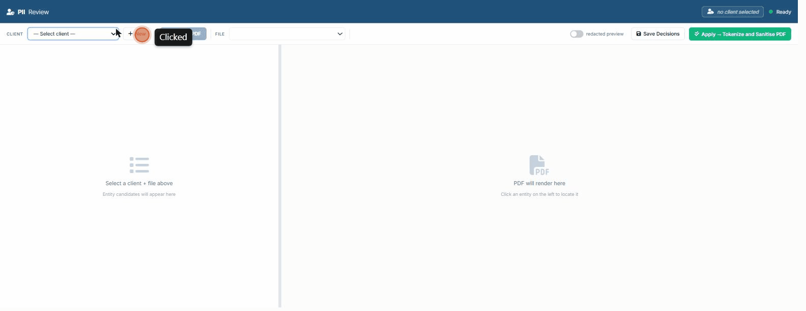
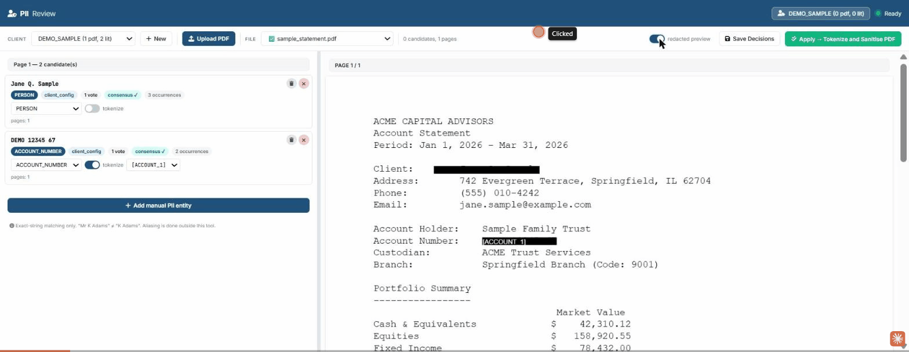

# PII Review

Local-only Flask app for redacting and tokenizing PII in PDFs before they
leave your machine. Designed as the privacy stage upstream of any cloud LLM
or VLM extraction pipeline: you review and tokenize the PDF locally, then
hand the safe (PII-free or tokenized) PDF to your downstream consumer.





## Why this exists

If you're sending client financial PDFs (statements, contracts, tax docs)
to an LLM or VLM for extraction, you've got a privacy problem: the names,
account numbers, and addresses leak into the prompt. PII Review sits in
front of that pipeline:

1. **Analyze** — extract bounding boxes for every word + every detected
   PII candidate (PERSON, ACCOUNT_NUMBER, ADDRESS, EMAIL, PHONE_NUMBER, etc.)
2. **Review** — human-in-the-loop FE for accepting/rejecting candidates,
   adding missed entities manually, and choosing per-entity tokenize vs
   strip behavior.
3. **Apply** — burn the decisions into the PDF, producing both a tokenized
   version (entities replaced by reversible tokens like `[ACCOUNT_1]`) and
   a fully sanitized "safe" version (entities removed entirely).

The tokenization is reversible (via the `.map.json` artefact) — downstream
extraction can run on the tokenized PDF and you re-substitute the original
values at the end without ever sending raw PII to the cloud.

## Quick start

### 1. System deps

- Python 3.10+
- [Poppler](https://poppler.freedesktop.org/) — provides `pdftotext` with
  `-bbox-layout`. On Linux/macOS this usually comes with your distribution
  package manager (`apt install poppler-utils` / `brew install poppler`).
  On Windows, install Poppler separately and set `POPPLER_BIN_DIR` in
  `.env` to its `bin/` directory (see `.env.example`).

### 2. Python deps

```bash
pip install -r requirements.txt
python -m spacy download en_core_web_lg
```

### 3. Configure

```bash
cp .env.example .env
# Edit .env if you need to override the defaults (port 5000, localhost).
```

### 4. Run

```bash
python pii_review_server.py
```

Open http://localhost:5000/pii_review in a browser.

## Workflow

1. **Create a client** (top-left dropdown → "+ New"). Clients group PDFs
   that share the same set of literals to redact (e.g. one client per
   downstream recipient).
2. **Upload a PDF.** The analyze worker runs `pdftohtml` + `pdftotext` +
   PyMuPDF + Presidio + spaCy NER to extract text bounding boxes and
   detect PII candidates.
3. **Review** the candidate list. Accept/reject each one. Click on the
   rendered PDF to manually select text and add it as a literal.
4. **Save Decisions** — propagates choices to the client config so future
   PDFs in the same client auto-detect the same literals.
5. **Apply → Tokenize and Sanitise** — produces `<stem>_tokenized.pdf` and
   `safe/pii_safe_<uuid>.pdf` in `output/pii_review/clients/<client>/`.

## Selecting text on the PDF (mouse modes)

The rendered PDF on the right is interactive. Hovering highlights what
will be selected; clicking commits a selection that you then add to the
entity list (via the `+ Add manual PII entity` modal pre-filled with the
selected text). Three modes:

| Action | Selects |
|---|---|
| **Click** | The whole `xml_text` element under the cursor (default — usually a full address line, account number, name as printed) |
| **Ctrl+click** | Adds another `xml_text` to the current selection — useful for merging across line breaks (e.g. a name spanning two lines, or an address that wraps) |
| **Alt+click** | A single word at the click point, not the surrounding `xml_text` — useful when only one word in a longer phrase is the PII (e.g. picking out just the customer name from a header that includes their title) |
| **Ctrl+Alt+click** | Adds a single word to the current selection — combines `Ctrl` (add) + `Alt` (word) |

The selection box highlights in yellow as you hover/select, and the
selection HUD (bottom-left) shows the joined text plus how many matches
this string has in the rest of the PDF. Press `Enter` to commit as a PII
entity, or `Esc` to clear.

See the second GIF at the top of the README — it shows the selection HUD
with joined text + match count when you click on the PDF, then the
redacted-preview toggle blacking out the committed entities.

## Outputs

For each Applied PDF in `output/pii_review/clients/<client>/`:

| File | Purpose |
|------|---------|
| `<stem>_clean.pdf` | PyMuPDF re-save of the input, metadata stripped |
| `<stem>_viz_data.lite.json` | Per-word bounding boxes (downstream pipeline input) |
| `<stem>_pii.json` | Detected candidates + per-entity decisions |
| `<stem>_tokenized.pdf` | PDF with PII replaced by tokens like `[ACCOUNT_1]` |
| `<stem>_tokenized.pdf.map.json` | Reversible mapping: token → original value |
| `safe/pii_safe_<uuid>.pdf` | PII fully stripped (no recoverable tokens) |

See `CONTRACT.md` for the schema downstream consumers can pin to.

## Limitations

**Image-based PDFs are not supported.** This tool operates on the PDF
text layer (`pdftohtml` + `pdftotext` + PyMuPDF extraction). If your input
is a scanned PDF with no embedded text — pure raster images of pages —
the analyze step produces zero words, the entity list stays empty, and
there's nothing to redact. You'll need to run OCR first (e.g. `ocrmypdf`)
to add a text layer before feeding the PDF to this tool. Future work: add
an optional OCR pre-pass so image-only PDFs become usable end-to-end.

**Other things this tool deliberately doesn't do:**
- No batch/headless API — the workflow is human-in-the-loop by design,
  with the FE as the only interaction surface. The `/api/pii-review/*`
  endpoints are for the FE; calling them from scripts will work but isn't
  the supported path.
- No cloud LLM detection — PII candidates come from spaCy + optional NER
  consensus + Presidio regex, all local. The reasoning behind this is the
  whole-tool's purpose: keep the raw PII off the wire. Sending PDFs to a
  cloud LLM for "smarter" detection would defeat that.
- No automatic alias resolution — `"Mr K Adams"` and `"K Adams"` are two
  distinct literals; you accept/reject each independently. Aliasing is
  intentional out-of-scope (it's a domain decision: "is the customer's
  preferred name also the legal name?" depends on your use case).
- No reversal step UI — `<stem>_tokenized.pdf.map.json` carries the
  `token → original value` mapping for downstream consumers to do the
  un-tokenize themselves; the tool itself doesn't ship a reverse-from-map
  utility (trivial to write: open the tokenized PDF, replace each
  `[TOKEN_N]` span text with the mapped value).

## Optional NER models

The PERSON detector uses a multi-model consensus (only entities agreed on
by 2+ models survive). The required baseline is spaCy `en_core_web_lg`;
additional models improve precision/recall but are all optional:

```bash
pip install transformers torch      # HuggingFace dslim/bert-base-NER
pip install flair                   # Flair ner-english-large
pip install stanza                  # Stanford Stanza
python -m spacy download en_core_web_trf  # spaCy transformer model
```

Tradeoff: more models → fewer false positives, slower analyze step.

## Privacy + security

- **Local-only by design.** No ngrok tunnel, no cloud calls, no telemetry.
  All processing happens on your machine.
- **No data in this repo.** `data/` and `output/` are gitignored; never
  commit real client PDFs or outputs.
- **No PII in logs.** The `M-ROT-EVID` debug stream redacts entity text
  (logs `entity_len=N` only) and is gated behind `PII_REVIEW_DEBUG_MROT`.
  Set `?debug=1` in the URL to enable verbose browser console logs (also
  off by default).
- **Reversible tokenization** keeps `.map.json` local; the cloud-bound
  tokenized PDF never reveals the original values.

## Debug flags

| Flag | Effect |
|------|--------|
| `?debug=1` URL param | Enable verbose browser console logs (per-click, per-hover) |
| `PII_REVIEW_DEBUG_MROT=1` env | Enable per-occurrence rotation-derivation logging (entity length only, never value) |

## License

MIT — see `LICENSE`.

## Status

Public release of a tool that ran in private production against a real
multi-client document corpus. The byte-for-byte behavior matches the
private build (verified across 5 clients × 39 PDFs × 6 artefacts = 234
verdicts, all PASS).

Two known FE quirks were fixed during the public-prep verification:
- Manual-entity modal Category dropdown now resets to `OTHER` between adds
- Entity card category/tokenize toggle now propagates back into the
  manual_additions[] entry on Save

If you find more, open an issue with a reproduction.
